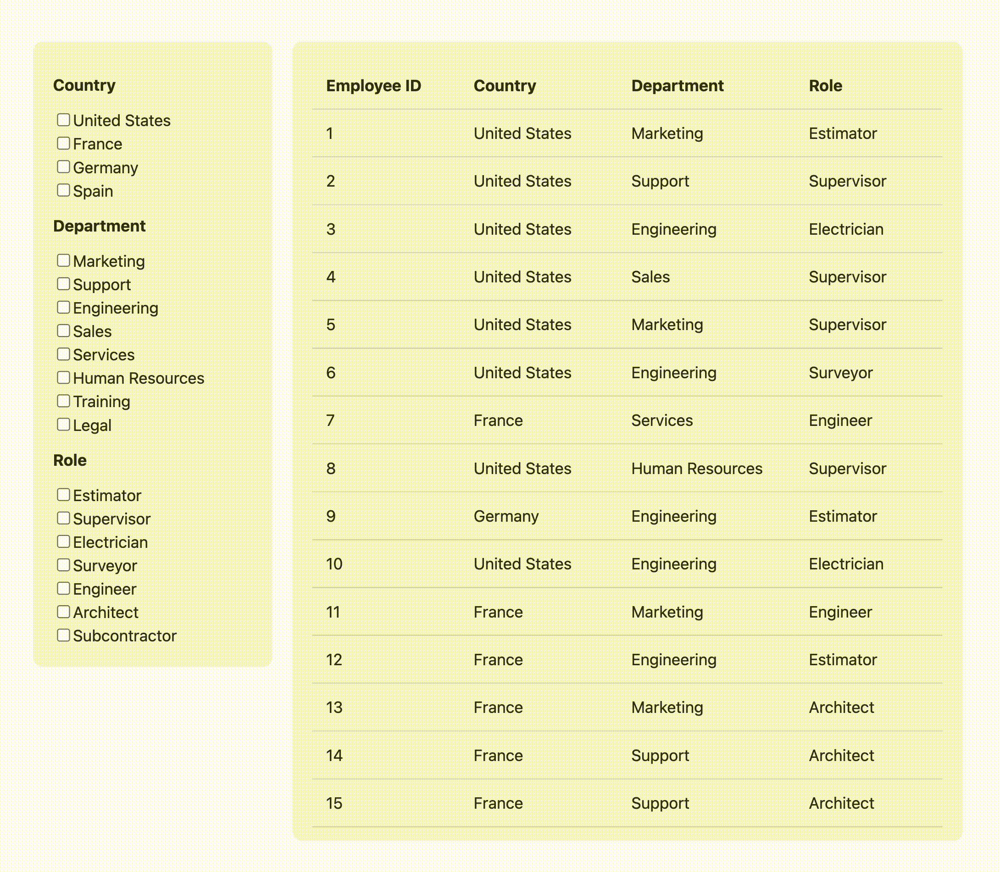

# Home assignment

## Requirements
- Given a database, your task is to display its data as a table on the UI.
- The table should display employee data and have following columns:
    - First name
    - Last name
    - Role
    - Country
    - Department
- You must use React, other than that you can use any library/package you want and change file structure as you like.
- Choose CSS styles as you like, it doesn't have to be 1:1 as example below.
- Make sure your solution is fully functional in dev mode, you don't need to build it.
- Submit your solution in a .zip file, or upload it somewhere and provide a link.
- Bonus points: add Filters section where user can filter table by role/country/department. (You can request filter options from DB or hardcode it)

## Database
This assignment uses MySQL database in a Docker container. The database contains demo records, you don't need to change it. Below are the example steps on how to run it:

```
docker build -t assignment_db .
```

```
docker run --name assignment_db -p 3306:3306 -d assignment_db:latest
```

The default configuration is:
- port: `3306`
- username: `root`
- password: `password`
- database: `assignment_db`

You can use any driver/ORM you want, the minimal example usage is:
```js
import mysql from "mysql2/promise";

const connection = await mysql.createConnection({
  host: "localhost",
  user: "root",
  password: "password",
  database: "assignment_db",
});

const [results] = await connection.query("SELECT * FROM employees");
```

## Server
Your server code implementation should be in the `/server` directory. Add a command to start the server to the package.json, for example `npm run start:server`.

## Client
Your client code implementation should be in the `/client` directory. You can use [Vite](https://vitejs.dev/), [CRA](https://create-react-app.dev/), or any other template. Add a command to start the client to the package.json, for example `npm run start:client`.

## Example
